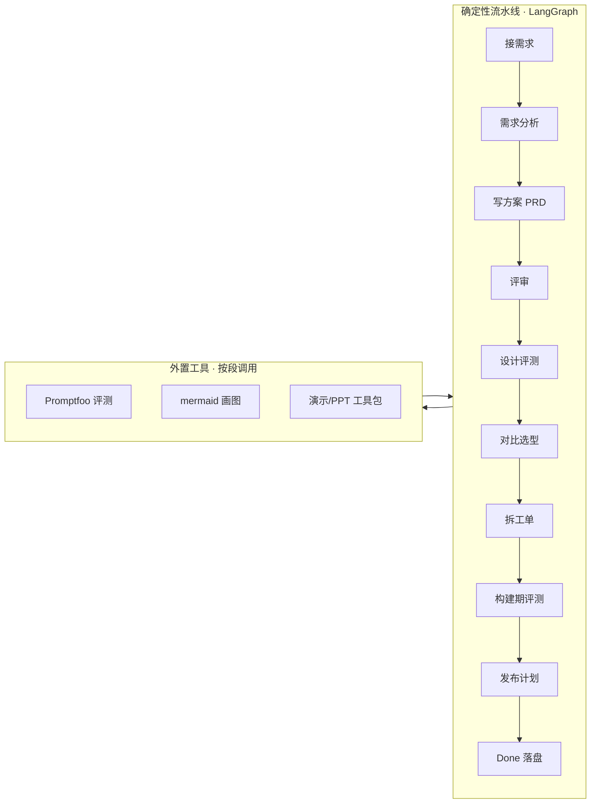

# AI PM Agent

[]()
[]()
[]()

给「AI 产品经理」这个职业做的工作流助手。你给它一个想法，它按顺序走完一套 PM 流程——接需求、把需求问清楚、写方案、请人评审、拆开发任务、定上线计划——每一步交出一份能直接用的 Markdown 文档。

- **重活**走确定性流水线：想法 → 需求分析 → 写方案 → 评审 → 设计评测 → 对比选型 → 拆工单 → 构建期评测 → 发布计划 → 落盘
- **轻活**由常驻 Agent（Pi 内核 + PM 技能）直接做
- 单 Agent，不做多 Agent 管道；产物一律 Markdown，演示物外置



## 为什么值得看

- **819 个测试全绿**（全部本地假 LLM，零 API 依赖，CI 可验证）
- **20 节点确定性流水线**，每步出结论由代码硬算，可复现、可追溯
- **判断内嵌、执行外置**：需要「过不过 / 推不推荐」的判断留在代码里，跑评测/画图/做演示交给外面现成的工具，通过路由表登记、按段调用、只传数据进出
- **8 处停下来等真人确认**，不替用户做决定

## 仓库里有什么（= AI 本体）

```
src/            流水线内核（节点 / 判定 / 状态机 / 提示词 / 校验）
tests/          819 个测试
scripts/        入口脚本（run_prd_workflow 等）与工具脚本
artifacts/      产物模板
.pi/skills/     内置 Agent 技能（PM 技能 + 操作手册）
references/     项目自制参考（外置工具路由、模型候选清单、流水线拓扑等）
docs/           核心规格：PRD.md、technical-design.md、workflow-design.md、职能标准调研
工具与参考/文字改写/   自制文字改写技能（humanize-writing）
```

这个仓库**只有 AI 本体**。会话记忆、任务书、调研草稿等开发过程文档不上仓库（留在本地）。

## 快速开始

**环境**：Python 3.11+，`pip install -r requirements.txt`，`cp .env.example .env` 填模型密钥。

```bash
PYTHONPATH=src python scripts/run_prd_workflow.py --requirement "你的需求描述"
# 跑到停下来等人确认的地方会打印 STATUS: HITL，你答复后继续
# 中断后可从上次停处续跑：PYTHONPATH=src python scripts/run_prd_workflow.py --resume
```

**跑通的样子**（约 1-3 分钟，需要真实 API Key，会消耗 DeepSeek 额度）：

```
STATUS: HITL   NODE: requirement_confirm   THREAD_ID: 8f3a...
# 流水线把需求复述给你，等你确认走 AI 轨还是普通轨
> 确认
STATUS: DONE
# 产物落在 output/<需求名>/ 下：需求文档 / 洞察 / review / 研发工单 / 发布计划
```

**测试**：`PYTHONPATH=src python -m pytest tests/ -q`（全部本地假 LLM，不需要真实 API）。

**模型**：默认 `DEEPSEEK_API_KEY`（deepseek/deepseek-v4-flash）；也支持 Anthropic / Gemini / Ollama 本地模型，`config.yaml` 的 `llm.providers` 取消注释即可。密钥只走环境变量，不硬编码。

## 用之前要连接什么（依赖都在外面）

仓库不内置密钥与工具实体。模型见上；外部工具按需装好、在 `references/外置工具路由.md` 登记路径即可：

| 用途 | 工具 | 仓库引用点 | 装在哪 |
|---|---|---|---|
| 评测 / 对比选型跑分 | Promptfoo | `config.yaml` → `eval_tools` / `bake_off` | `工具与参考/Agent外置工具包/AI评测工具包/` |
| 画流程图 / 架构图 | mermaid-cli | `references/外置工具路由.md` | `工具与参考/Agent外置工具包/演示工具包/` |
| 演示 / PPT | 演示工具包 | 同上 | 同上 |
| 领域知识库检索 | ChromaDB + 嵌入 | `config.yaml` → `domain_kb` | 本地 `domain_kb/`（建库后才有） |

> `工具与参考/Agent外置工具包/`、`工具与参考/PM项目参考/`（第三方参考库）被 .gitignore 排除、不进仓库。克隆后按上表装到对应位置即可。领域知识库语料需自行准备。

## 给 Agent 读的文档

人看 `README.md` 与 `docs/`；**给运行本产品的 Agent 读的人设与纪律见 `AGENTS.md`**，操作手册见 `.pi/skills/agent-manual/`。

## License

[MIT](LICENSE)
