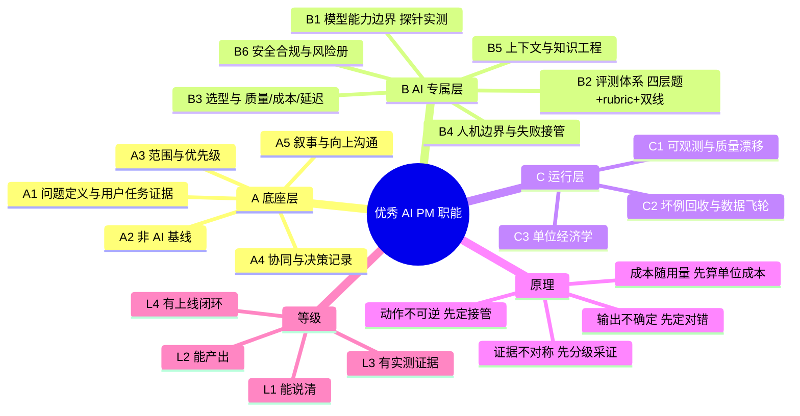

# 优秀 AI 产品经理的职能标准与能力模型（调研）

> 用途：本项目（AI PM Agent）的**要求来源**。先定「一个优秀 AI PM 必须做到什么」，再反推这个 Agent 必须提供什么、做到什么程度；项目 PRD 的验收以此为准。
> 日期：2026-09-15｜调研人：主 Agent（自研结论 + 外部证据）
> 声明：本文第三节「职能标准」与第四节「对本项目的要求」是**本项目的自研结论**；一、二节是外部证据摘录，逐条标了出处。未取到全文的来源在第九节标注。

---

## 一、结论先给

一个优秀的 AI 产品经理，职能上要同时满足四件事，缺一件就算不达标：

1. **把模糊机会翻译成可判定的任务**——说清用户任务、非 AI 基线、失败边界；
2. **在开发前就定义「什么算对」**——评测集、评分规则、及格线先于实现；
3. **设计人机边界**——不可逆的动作谁确认、低置信度谁接管、出错给用户看到什么；
4. **对上线后的质量、成本、风险负责**——上线后能看见质量漂移，能回收坏例，能算清单次任务成本。

这四件事的底层是四个不可回避的物理事实（见第五节），不是行业偏好。

本项目当前已经建成的 12 段流水线，覆盖了上面第 1、2、3 件事的大部分（第 0-9 段），第 4 件事只做到接口层（第 10-11 段二期）。对照表见第四节。

---

## 二、外部证据（2026 年市场说法）

### 2.1 国内 + 海外大厂 54 份 JD 的六大发现

来源：《想入行/转型 AI PM？深扒 54 份头部企业 JD，我的 6 大发现》，人人都是产品经理，2026-01-17（拆解字节、腾讯、蚂蚁、OpenAI、Anthropic 等 14 家企业 54 份 JD）。
链接：https://www.woshipm.com/zhichang/6326220.html

| 发现 | 内容 |
|---|---|
| 一 | **通用产品核心能力仍是护城河**，明确为五维：全生命周期管理与战略规划／深度需求洞察与业务抽象／项目管理与跨职能协同／数据驱动决策／高管级沟通与影响力 |
| 二 | **AI PM 职能正在 Agent 化**：字节（Prompt 工程、知识库、工作流、Agent 系统优化）、美团（大模型应用开发全流程、Prompt 工程、RAG、**Agent 测评标准输出**）、腾讯元宝（用 RAG、Tools、Memory 提升体验）、阿里天猫（识别 Agent 能力在客服/供应链的应用点）、微软 M365（**开发 AI 评估系统用于智能体检测**）、OpenAI（定义并交付 Agent 核心模块：模型与工具编排、安全护栏） |
| 三 | **专岗崛起**：Agent Infra/平台 PM、ToB 企业级 Agent PM、垂直行业 Agent PM；以及按环节拆出的三类专项岗——**训练与对齐**（SFT/RLHF、合成数据）、**评测与实验体系**（自动化评测、细粒度指标、训练-实验-发布闭环）、**Context 与语言工程**（管理上下文窗口、设计评估模型的评分器） |
| 四 | **能力画像分四级**：技术架构与组件设计（LLM/AIGC 边界 → RAG/Tools/Function Calling 编排 → Multi-Agent/Memory/MCP）；Context & Prompt Engineering（Prompt 设计 → 上下文治理 → 写评分器）；数据策略与模型对齐（数据收集构造与标注反馈 → SFT/RLHF/合成数据 → 引领模型行为方向）；**评估与实验体系**（建指标体系 → 自动化评测与 Benchmark → 与业界评测标准保持一致、打通训练-实验-发布闭环）；业务建模与场景交互设计；实操工具与代码背景（LangChain、Coze/Dify、Cursor）；**行业动态追踪（阅读最新论文/报告并给团队技术洞察，被明确写进多份 JD 职责）** |
| 五 | 行业仍处强技术驱动阶段，要求两极分化：通用化的「把前沿技术转成可落地方案」与具体技术栈深挖（RAG/Prompt/工具调用/Memory/多智能体）并存 |
| 六 | 2026 是转型窗口：门槛宽松，看重在模糊 0-1 场景里定义问题的能力与成长型思维；经验背景多元（主导过 0-1 的资深 PM、低代码平台上的产品黑客、AI 产品重度用户都能进核心战场） |

该文的一句判断值得单列：**「能够做出来已经不再是壁垒，证明它好用且可靠才是真正的护栏。」** 以及「JD 中频繁出现的词汇不再是精通 Axure，而是阅读最新论文、动手写代码原型、黑客思维」。

### 2.2 AI PM 岗位职责与核心能力模型（国内求职侧口径）

来源：《AI产品经理岗位职责2026：JD要求与6类核心交付物》，Offer库，更新于 2026-08-20。
链接：https://chanpinjingli.org/blog/blog-ai-pm-role-guide

**一句话定义**：AI 产品经理负责把**用户任务、模型能力和业务约束**连接成可用产品。工作重点不是追模型名词，而是判断：什么问题值得用 AI、效果如何验证、错误如何被发现和恢复、成本与延迟是否可接受、上线后谁对风险负责。

**核心交付物六项**（把这六项做出来才算干了活）：用户任务与非 AI 基线／产品流程和原型／评测集与评分规则／失败与人工兜底流程／成本延迟与安全边界／上线门槛和迭代数据。

**从需求到上线的五步链路**：①任务定义（用户现在怎么做、哪一步贵/易错、AI 相对规则与人工的增量价值、哪些任务明确不做）②基线与可行性（非 AI 基线 + 当前模型基线、数据/工具/延迟/成本/隐私/工程依赖；**能生成结果的原型不等于可上线产品**）③评测设计（典型/边界/高风险输入；通过、部分通过、严重失败三档；确定性检查 + 模型评分 + 人工评审组合）④交互与控制（来源、编辑、拒绝、重新生成、追问、人工转接、回退）⑤灰度与运营（上线人群、权限、发布门槛、护栏、停止条件；记录模型/提示词/知识库/工具版本；线上失败加入回归集）。

**核心能力模型六维**：
- 用户与产品判断：把「用 AI」改写成具体用户任务；区分用户表达、真实需要与系统约束；比较 AI 与非 AI 方案；定目标、非目标与失败边界。
- 技术理解：能讨论模型输入输出、上下文与结构化结果；RAG、工具调用与工作流；延迟/成本/缓存/重试/依赖；数据来源、版本、隐私与访问控制。**标准是能参与取舍，不是背诵定义。**
- 评测与数据：定义任务成功与严重失败；建评测集、切片与基线；设计人工评审与评分器校准；连接离线质量与线上行为；**防止平均分掩盖高风险退化**。
- 交互设计：校准预期、让不确定性与来源可见、提供修改/拒绝/撤销、高风险动作要确认、系统失败时安全退出。
- 商业与风险：每个成功任务的总成本、用户愿等的时长、人工审核与支持成本、隐私/安全/偏差/责任、供应商依赖与降级路径。
- 跨团队协作：在用户、业务、数据、算法、工程、安全、法务之间翻译约束；**清晰的任务定义、决策记录与验收标准比模糊的「协调资源」重要**。

**自测清单 9 条**（可当达标自检）：能用一句话定义用户任务／能提出至少一个非 AI 基线／能区分模型指标、产品行为与业务结果／能设计典型+边界+高风险样本／能说明信息不足时如何处理／能同时讨论质量、延迟、成本与风险／能为高影响动作设计确认与撤销／能把失败转成可执行的产品或工程动作／能准确说明自己的贡献和限制。

### 2.3 evals 是 AI PM 的第一技能

来源：《Mastering AI Evals: A Complete Guide for PMs》，The Product Compass（Paweł Huryn 对话 Hamel Husain，后者 20 年 ML 经验、带过 Airbnb/GitHub 团队），2025-04-26。
链接：https://www.productcompass.pm/p/ai-evals

- 判断：**Evals 正在成为 AI PM 的头号技能**（"the top skill for AI PMs"）。
- 观察：失败的大模型产品几乎共同指向同一个根因——**没有建立稳健的评测系统**；「团队花几周搭复杂 AI 系统，却答不上来自己的改动是变好还是变坏」。
- 反直觉结论：成功的团队「几乎不聊工具」，而是死磕**测量与迭代**（which vector DB / which provider / which framework 都不是决定项）。
- 评测飞轮（eval flywheel）是把评测从一次性 debug 变成持续质量机制的做法。

### 2.4 AI PM 招聘评估框架（市场对 AI PM 的定价）

来源：Applied AI PM Framework 2026（开源，六支柱 60 分制、四档决策），受 Google Director of AI Product Jaclyn Konzelmann 的评估框架启发。
链接：https://aipmframework.com/

| 支柱 | 判据（摘要） |
|---|---|
| 技术技能与动手能力 | 近期真实编码/个人项目/几小时出原型 |
| 产品思维与 0→1 领导力 | 从 0 到 1 落地案例、用户中心的问题定义、模糊中推进 |
| AI/ML 知识与直觉 | 个人 AI 项目 = 证据；能解释为什么这个场景选这个模型 |
| 沟通与公开构建 | 技术博客/仓库/可复现 demo，能把复杂讲简单 |
| 战略与二阶思维 | 平台思维：随模型变强而变好的工具；今天 vs 明天的 AI |
| 执行与快速交付 | 以「天」为单位的交付节奏；「我做了」而不是「我管理过」 |

该框架的一句立场：**「Builders over coordinators」——2026 年不招只协调的人。** 注意：这是**招聘市场说法**，里面「公开构建/粉丝量」之类的信号属于个人品牌证据，不能直接搬成产品要求；但它对「动手验证优先于纸面推演」的定价，与本项目「探针真跑」（探针＝拿几个真实样例试跑模型）的取向一致。

### 2.5 AI PM 工作流、交付物与发布门（停下来等确认的地方）（可执行的工程侧范本）

来源：AI PM Playbook（开源），2026。
链接：https://github.com/zaidazmi/AI-PM-PLAYBOOK

**12 步工作流**：选对机会 → 限时原型验证（可抛弃）→ 定义 AI 的工作 → 设计用户工作流 → 明确数据/模型/系统要求 → 定义评测与质量线 → 识别风险与缓解 → 成本与业务价值建模 → 设发布门 → 分阶段放量（影子/金丝雀/同批）→ 埋生产行为观测 → 上线后运营改进。

**八类核心交付物**（PM 的活就是产出这些，不是开会）：AI Opportunity Brief（先于 PRD：为什么用 AI、为什么确定性软件不够、最小可用版、不做会怎样）、AI PRD、AI Eval Plan、Risks & Mitigations、Human Review Workflow、Launch Gate Checklist、Observability Plan、AI Cost Model。

- **AI PRD 必备节**：AI 的工作（一句话模板：The AI [does what] using [inputs] to produce [outputs] for [user] inside [workflow], subject to [constraints]）／输入输出契约／自主级别／人工审核规则／质量线／延迟目标／成本约束／失败与兜底行为／**约束与护栏（输入范围、提示注入、接地、动作范围、安全、成本上限，各自带阈值与责任人）**／可观测要求／发布门／未决问题。
- **Eval Plan 最小标准**：1 条典型 happy path + 1 条常见边界 + 1 条不可接受输出 + 1 条安全/政策边界 + 1 条真实失败回归例。
- **Eval 反模式**：用某个模型的输出当金标准（放大该模型偏见）／把 100% 通过当成功（说明题太简单）／按工具调用序列判 Agent 而不是判结果／非确定性输出只跑一次／跳过 Agent 边界的集成测试。
- **证据分级（Evidence Hierarchy）**：T1 实测数据（生产指标、A/B、标注集评测分）＞T2 直接用户证据（访谈原文、可用性观察、工单）＞T3 结构化分析（带假设的成本模型、有出处的竞品分析）＞T4 干系人口头意见 ＞T5 PM 直觉。**当 T4/T5 驱动了发布决策，必须显式标记。**
- **就绪度打分（Readiness）**：11 个维度各 0-5 分（缺失/提及未定义/已起草未验证/有部分证据/强证据可发布/上线且有人在改进），带权重——其中 **Eval readiness 权重最高（1.5）**，其后是风险与安全（1.4）、监管就绪（1.3）、可观测（1.3）；6 档结论从「未就绪」到「可规模化」。
- **三级发布阻断条件**：阻断面向客户生产（评测就绪 <3、高影响动作无人审、低置信度无兜底、可观测 <3、数据权限不清、单次成本未知、风险无责任人、无上线后质量复盘节奏、无回滚验证…）／阻断试点／阻断扩量（试点质量未复盘、成本超出未经商业决策、用户大量绕过或重写输出、回归检查缺失、事故响应未演练）。
- **Agent 专属失败模式**（除通用风险外）：目标劫持、工具误用、身份滥用、记忆投毒、跨步错误级联。

---

## 三、我提炼的职能标准（本项目自研结论）

### 3.1 分层结构

把上面证据交叉后，AI PM 的职能分成三层，共 14 项。**底座层不因 AI 而放宽**（54 份 JD 的发现一），AI 专属层是新增的硬门槛（发现二/三/四），运行层是「上线后谁负责」的答案（Playbook 的 observability + cost model）。

```
AI PM 职能标准
├─ A 底座层（5 项）：通用 PM 护城河，AI 不放宽
│  ├─ A1 问题定义与用户任务证据
│  ├─ A2 方案比较与非 AI 基线
│  ├─ A3 范围切分与优先级决策
│  ├─ A4 跨职能协同与决策记录
│  └─ A5 叙事与向上沟通
├─ B AI 专属层（6 项）：AI PM 的硬门槛
│  ├─ B1 模型能力边界判定（探针实测——拿几个真实样例试跑模型，看它能不能做；不吃榜单）
│  ├─ B2 评测体系设计（典型/边界/对抗/回放四层 + rubric + 及格线 + 回归）
│  ├─ B3 模型选型与三角权衡（质量/成本/延迟，拿自批考题实测）
│  ├─ B4 人机协作与失败接管设计（不让用户看见裸错误）
│  ├─ B5 上下文与知识工程（事实层、证据出处、按需检索）
│  └─ B6 安全合规与风险册（注入/越权/泄露/编造/监管分类）
└─ C 运行层（3 项）：上线后的责任
   ├─ C1 可观测性与质量漂移
   ├─ C2 坏例回收与数据飞轮
   └─ C3 单位经济学与商业化
```

### 3.2 每项的「达标证据」（这是把它变成要求的关键）

| 项 | 达标证据（不达标即不合格） |
|---|---|
| A1 | 一句话说清用户任务（谁、在什么场景、现在怎么做、哪一步贵或易错），而不是「做一个 AI 助手」 |
| A2 | 至少一条非 AI 基线（规则/模板/搜索/人工），并说明 AI 相对基线的增量价值 |
| A3 | 明确的目标、非目标与失败边界；哪些任务明确不让 AI 做 |
| A4 | 有取舍记录：谁在什么条件下拍板、依据什么；给算法/工程/安全的验收标准写清楚 |
| A5 | 能向非技术干系人讲清「为什么现在做、不做会怎样、风险在哪」 |
| B1 | 拿真实样例做探针实测，产出「能做/部分能/不能」的判定与证据（模型输出原文），**不引用榜单** |
| B2 | 有一套可重复跑的考题集（典型/边界/对抗/回放），带评分方式（代码断言/模型评审/人工）、双及格线（整体 + 关键题）、且**上线失败会回流成新题** |
| B3 | 同一批考题逐个跑候选模型（把同一批考题分别发给每个候选模型各跑一遍，比结果），报质量/成本/延迟三维；结论由数据得出，不由偏好得出 |
| B4 | 每个失败模式都有对应 UX 答案：低置信度怎么办、拒答怎么说、人工怎么接管、超时/超限怎么降级 |
| B5 | 上下文有事实层与出处；回答可溯源；不可变约束（法规/技术/战略）单列；证据不齐时明说 |
| B6 | 风险册含：注入、越权、数据泄露、编造（幻觉/假法条）、监管分类，每类有阈值与责任人 |
| C1 | 上线后能看到采纳率/编辑率/拒绝率/转人工率/延迟/单次成本/质量分，以及质量漂移告警 |
| C2 | 线上坏例有回收通道，进考题集，月度复评，模型/提示词/知识库每次变更走回归 |
| C3 | 算得出单次任务成本 = 输入 token×单价 + 输出 token×单价 + 检索/工具成本，含重试与上下文累积；对照人工成本 |

### 3.3 能力等级（自评用，L1-L4）

同一项职能分四级：**L1 能说清概念｜L2 能独立产出该产物｜L3 产物有实测证据支撑｜L4 有上线数据与持续闭环。**

判断一个 AI PM 或一个团队是否「优秀」，看的是**有多少项到 L3、有没有项到 L4**；只看 L1/L2 的，就是 Playbook 说的「demo 做得出来、产品做不出来」。这份等级也是本项目的产品目标：**把用户从 L1/L2 顶到 L3**，并在有数据后提供 L4 需要的东西（放在哪：产物、数据与流程）。

---

## 四、对本项目（AI PM Agent）的要求

把上面 14 项落到已建成的 12 段流水线上，得到 12 条硬要求。状态列是 2026-09-15 的代码实况（依据 `docs/workflow-design.md` 第七节）。

| # | 要求 | 对应段/节点 | 状态 |
|---|---|---|---|
| R1 | 每段产物必须可判定：要么代码硬判，要么显式标注「需人工判断」，不留「看起来还行」 | 全段（judge 纯函数 + 三/四态 HITL） | ✅ 已达标 |
| R2 | 评测先于开发：需求确认后即建初始考题集，写 PRD 时已有题目，构建期回填 | 第 1 段建题 → 第 5 段成体系 → 第 8 段跑 | ✅ 已达标（eval_cases 随需求生长） |
| R3 | 模型能力必须实测判定，不吃榜单、不做纸面推演 | 第 2 段探针（三方对照 + ReAct 真跑 ≤8 轮 + 证据回填） | ✅ 已达标（真实 5 探针全跑） |
| R4 | 交付前必须给出「人机边界」：哪些自动、哪些工具、哪些必须人工，且写进 PRD | 第 2 段产出 → 第 3 段 ai-native 模板的协作边界表/失败接管列 | ✅ 已达标 |
| R5 | 失败与兜底是 PRD 的必备章（不是可选项）：低置信度、拒答、转人工、超时降级 | 第 3 段 ai-native 模板（负向验收 + 风险册） | ✅ 已达标 |
| R6 | 评测体系含四层考题（典型/边界/对抗/回放）+ rubric + 双及格线，且需用户确认 | 第 5 段 eval_design + eval_confirm | ✅ 已达标（对抗题压越权/泄露/注入） |
| R7 | 选型用同一批考题逐个跑候选，报三维（质量/成本/延迟），结论代码硬判 | 第 6 段 bake_off（调 Promptfoo） | ✅ 已建，真机复跑待做（首次跑的数据被阅卷模型缺失污染） |
| R8 | 构建期跑真评测，未达及格线不得发布，不自动放行 | 第 8 段 eval_run（subprocess + 硬判 + 三态 interrupt） | ✅ 已达标 |
| R9 | 发布计划必须含量化 kill 阈值、cohort 灰度、回滚与 go/no-go、值班 | 第 9 段 launch_plan（9 错 4 警硬判） | ✅ 已达标 |
| R10 | 证据分级：产物里的每条关键结论标注来源等级（实测/用户/分析/口述/直觉），T4/T5 驱动的决策显式标记 | 全段产物 | ⚠️ **未做**（我们只有「有/无证据」，没有证据等级） |
| R11 | 就绪度：发布前对 11 个维度打分并给阻断条件（试点/生产/扩量三级） | 第 9 段及收尾 | ⚠️ **部分**（有 go/no-go 与字段自检，无分级就绪度打分） |
| R12 | 上线后：可观测（质量漂移/成本/采纳率）+ 坏例回流考题集 | 第 10/11 段 | ⚠️ **二期接口**（本期只产监控计划，不接在线数据） |

另外两条与「优秀」相关的产品能力要求（不属于段，属于整个 Agent 的表述方式）：

- R13 **行业动态追踪**：54 份 JD 把「持续跟踪前沿论文/报告并给团队技术洞察」写成岗位职责。本项目目前只在「接到活先查家底」（kb_lookup）里做检索，没有「主动跟踪 + 定期汇报」的通道。属未做。
- R14 **表述像 PM 而不是像工具**：产物要是 PM 能直接进评审的语言（业务术语、取舍说明、证据出处），不是技术堆料。当前产物表述由模板与 prompt 决定，未做系统校准。

---

## 五、底层原理（为什么是这些职能）

四个事实决定了这套职能不是行业偏好，而是必然：

1. **输出不确定** → 必须先定义「什么算对」。传统软件可以「写完即正确」，模型输出是概率分布，所以评测必须早于实现（R2/R6/R8）。这也是 Playbook 把 eval readiness 权重给到最高的原因，也是 Hamel Husain 说失败产品共同根因是「没有稳健评测系统」的原因。
2. **动作有外部后果且常不可逆** → 必须设计接管与确认。发消息、扣款、改状态、下法律结论都收不回来，所以要有自主级别、人工审核、回滚、幂等（R4/R5/R9）。Agent 类产品还要防目标劫持、工具误用、身份滥用、记忆投毒。
3. **成本随用量而非随开发增长** → 必须做单位经济学。传统软件边际成本趋零，AI 产品每次调用都花钱，成本与延迟和质量互相挤压，所以 PM 必须持有这三个旋钮（B3/C3）。
4. **证据天然不对称** → 必须分级采证。模型能力、用户真实需求、真实成本都是估计，谁也无法一次性知道；所以要有证据分级（R10）、就绪度打分（R11）、上线后观测（R12）——目的是让人知道「此刻在依赖判断还是依赖数据」。

理解这四条，就能解释为什么「会不会用工具」不是门槛，而「能不能把不确定的事变成可测量、可接管、可控成本的事」才是门槛。

---

## 六、与现有素材的关系与差距

项目里已有两份职能相关材料，本文不替代它们，而是补它们缺的那一层：

| 已有材料 | 它的轴 | 缺什么 |
|---|---|---|
| `references/AI-PM职能主线.md`（2026-09-10） | 哪些职能建确定性流水线、哪些交 Pi：来源是三个参考库技能的概括（Workflow/Component/Interactive 三分法 + 阶段路由 + 四角色） | 只回答「怎么建」，不回答「做到什么程度算优秀」；无达标证据、无等级 |
| `docs/AI-PM职能与工具调研.md`（2026-09-08） | 60% 共通 + 40% AI 专属：四大核心（选型/评测/三角权衡/失败体验）+ 拓展六项（飞轮/上下文/可观测/合规/验证加速/商业化）+ 国内九段式日常 | 覆盖面够，但**没有可判定的达标证据**、没有能力等级、未覆盖 2026 JD 新出的评测专岗与 context 工程岗、没有证据分级与就绪度门 |
| **本文（新增）** | **职能标准**：14 项 × 达标证据 × L1-L4 等级 + 对本项目的 12 条硬要求 | 下一步：把 R10/R11/R13/R14 变成实施项（见第七节） |

**结论**：参考库给的是「技能与流程素材」，缺的是「标准与判据」。本文补上标准，并把标准直接钉到项目的段与节点上。

---

## 七、下一步（把标准变成活）

按「先能判定、再谈优化」的次序，缺口优先做三件：

1. **R10 证据分级**（优先级最高，改动小、收益大）：在产物模板与 state 里给关键结论加证据等级标记（沿用 Playbook 的 T1-T5 口径），让评审与被评审的人都看得见「这条是实测还是直觉」。落在第 3/4/9 段的产物模板。
2. **R11 就绪度打分**：第 9 段发布计划加 11 维就绪度（可先做其中与本项目相关的 6-7 维：问题契合、工作流契合、AI 任务定义、评测就绪、风险安全、成本、可观测、上线运营），输出分数与阻断级。
3. **R13 行业动态追踪**：给 Agent 加「主动跟踪 + 按月出技术洞察」的通道（可用现有 RAG 库 + 定时任务；对应 🔵R03 的 tracked-paper 周更新候选）。

R14（表述像 PM）属内容打磨，按项目说法留到有使用数据后再迭代。

---

## 八、思维导图



---

## 九、来源与未核实项

| 来源 | 日期 | 用途 | 可信度 |
|---|---|---|---|
| 人人都是产品经理《深扒 54 份头部企业 JD》 | 2026-01-17 | 国内+海外 JD 六大发现、能力画像四级、专岗分化 | 二手汇编（作者自述拆解 54 份 JD），方向可信，具体家数未独立核验 |
| Offer库《AI产品经理岗位职责2026》 | 2026-08-20 | 交付物六项、链路五步、能力模型六维、自测清单 | 机构内容，与 JD 口径一致 |
| The Product Compass《Mastering AI Evals》 | 2025-04-26 | evals 为第一技能、失败根因、评测飞轮 | 从业者访谈（Hamel Husain） |
| Applied AI PM Framework 2026 | 2026 | 六支柱 60 分制、builders 取向 | 开源招聘框架，属市场定价口径，非产品要求 |
| AI PM Playbook | 2026 | 12 步、八类交付物、证据分级 T1-T5、就绪度 11 维、三级发布阻断、Agent 专属失败模式 | 开源可执行范本，结构与本文要求直接对齐 |
| Arize《What is an AI product manager》(2026) | — | 计划引用 | **未取到全文**（站点 TLS 握手失败），本文未引其内容 |

**未核实**：国内对 AI PM 尚无官方职业标准，「职能标准」是市场口径 + 本项目自研的合成，不等于行业规范；本文的 14 项与 L1-L4 等级可用于内部对齐与产品要求，不宜对外宣称是行业标准。
